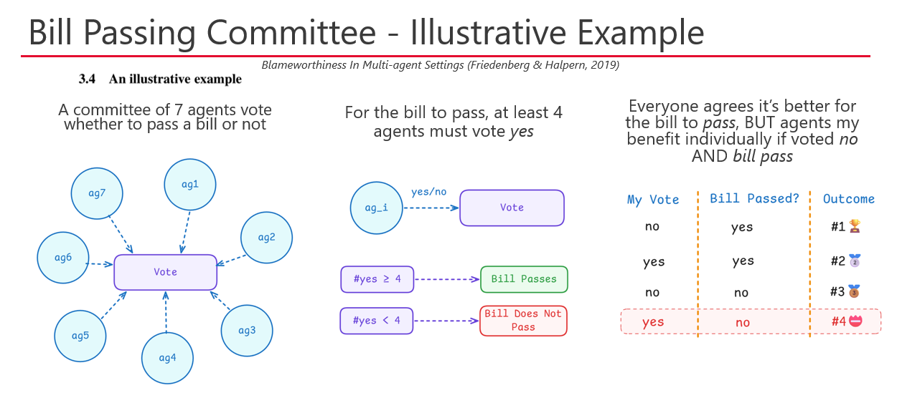
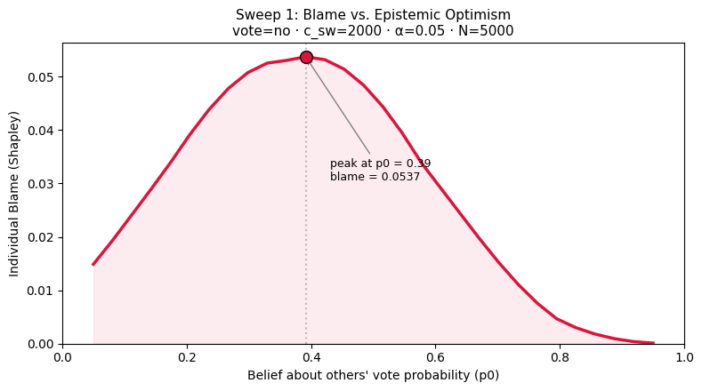

# An Empirical Study of Blameworthiness in LLM-based Multi-agent Settings

This project implements and empirically tests the group blameworthiness framework from [Friedenberg & Halpern (2019)](https://doi.org/10.1609/aaai.v33i01.3301525). The framework defines how to ascribe blameworthiness to groups of agents using causal models, then apportions it to individuals via the Shapley value. We first reproduce the paper's 7-voter-committee example computationally, then place LLM-based agents under the same scenario to see whether their behavior correlates with the theory's predictions.

## Research Questions

**Q1.** Can we reproduce the numerical results of the 7-voter-committee example, and what implicit assumptions must be made?

**Q2.** When LLM agents are placed in the same scenario under varying context (believed probability, cost), does their behavior shift in the direction the framework predicts?

## Repository layout

- `framework/`: Python implementation of the FH committee model (`committee.py`)
- `experiment/`: LLM sweep runner, prompts, and analysis notebooks
- `report/`: LaTeX source for the accompanying paper

## Key finding

LLMs reproduce the qualitative structure of FH blameworthiness, non-monotone blame curve peaking at moderate belief, non-zero blame for the correct voter, but are quantitatively miscalibrateds. Models evaluated: `qwen3-235b-a22b-2507`, `llama-3.3-70b-instruct`, `gemini-2.5-flash`.

For details, see the report in `report/main.tex`.

## Key Reference

Friedenberg, M., & Halpern, J. Y. (2019). Blameworthiness in Multi-Agent Settings. *Proceedings of the AAAI Conference on Artificial Intelligence*, 33(01), 525–532.

## Acknowledgements

This project was conducted as part of the MIIS 2025 course on *"Advanced Topics in Intelligent Interactive Systems"* at Universitat Pompeu Fabra. I thank my instructor and peers for their feedback and support throughout this research.

## License

This repository and all its content (including the manuscript) is licensed under GLP-3.0 License. See [LICENSE](./LICENSE) for details.
Any use of the code or manuscript must include proper attribution to the original author and source.
