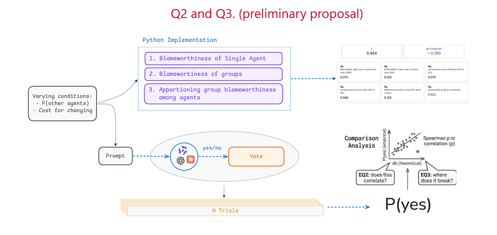

# An Empirical Study of Blameworthiness in LLM-based Multi-agent Settings

This project implements and empirically tests the group blameworthiness framework from [Friedenberg & Halpern (2019)](https://doi.org/10.1609/aaai.v33i01.3301525). The framework defines how to ascribe blameworthiness to groups of agents using causal models, then apportions it to individuals via the Shapley value. We first reproduce the paper's 7-voter-committee example computationally, then place LLM-based agents under the same scenario to see whether their behavior correlates with the theory's predictions.

## Research Questions

**Q1.** Can we reproduce the numerical results of the 7-voter-committee example, and what implicit assumptions must be made?

**Q2.** When LLM agents are placed in the same scenario under varying context (believed probability, cost), does their behavior shift in the direction the framework predicts?

**Q3.** Where empirical results diverge from theoretical predictions, which assumptions account for the discrepancy?

**Q4\*.** *(Bonus)* If agents are given means to communicate, do they form coalitions?

## Q2 Preliminary Proposal

## Course Blocks

| Block | Weeks | Status |
|-------|-------|--------|
| 0. Scoping | 1–3 | ✅ Done |
| 1. Theory | 4–5 | ✅ Done |
| 2. Implementation | 6 | 🔄 Starting |
| 3. Experimental Design | 7–8 | ⬜ |
| 4. Execution & Analysis | 9–10 | ⬜ |
| 5. Write-up | 10–11 | ⬜ |

## Key Reference

Friedenberg, M., & Halpern, J. Y. (2019). Blameworthiness in Multi-Agent Settings. *Proceedings of the AAAI Conference on Artificial Intelligence*, 33(01), 525–532.